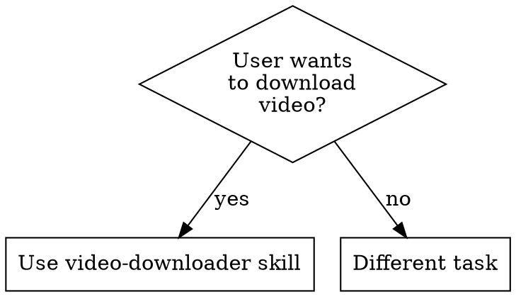

# Video Downloader

## Overview

Cross-platform video download and format conversion tool using yt-dlp and ffmpeg. Handles individual or batch downloads with intelligent quality selection, automatic format conversion, subtitle embedding, cookie-based authentication for login-required sites, and comprehensive error handling.

**Supported platforms:** YouTube, Vimeo, Bilibili, 小红书 (XHS), and 300+ other sites.

**Not supported:** Douyin (抖音), TikTok due to anti-scraping measures.

## When to Use



**Use cases:**
- Download videos from YouTube, Vimeo, Bilibili, 小红书, or 300+ supported sites
- Batch download multiple videos at once
- Extract audio-only from videos (MP3/M4A)
- Convert videos to standard MP4 format
- Embed subtitles into downloaded videos
- Handle large files with intelligent quality scaling

**When NOT to use:**
- User has local video files (use ffmpeg directly)
- User wants to download from Douyin/TikTok (not supported)
- User wants to stream rather than download
- Task is simple format conversion of existing files

## Quick Reference

| Use Case | Command Pattern |
|----------|----------------|
| Single video | `/video-downloader <URL>` |
| Batch download | `/video-downloader <URL1> <URL2> <URL3>` |
| Audio only | `/video-downloader --audio-only <URL>` |
| Custom path | `/video-downloader "save to desktop" <URL>` |
| Force quality | `/video-downloader --quality 720p <URL>` |
| **With browser cookies** | `/video-downloader --cookies-from-browser chrome <URL>` |
| **With cookie file** | `/video-downloader --cookies /path/to/cookies.txt <URL>` |
| **Channel download** | `/video-downloader --channel <URL>` |
| **Batch from channel** | `/video-downloader --channel <URL> --count 20` |

## Implementation

### 1. Dependency Management

**Check for existing dependencies:**
```bash
which yt-dlp    # Check if installed
which ffmpeg    # Check if installed
```

**Install based on platform:**

| Platform | Installation Command |
|----------|---------------------|
| macOS | `brew install yt-dlp ffmpeg` |
| Linux (Debian/Ubuntu) | `sudo apt install yt-dlp ffmpeg` |
| Linux (Fedora) | `sudo dnf install yt-dlp ffmpeg` |
| Linux (Arch) | `sudo pacman -S yt-dlp ffmpeg` |
| Windows | `winget install yt-dlp ffmpeg` or `pip install yt-dlp` |

**Fallback:**
```bash
pip install --upgrade yt-dlp  # Always works for yt-dlp
```

### 2. Download Commands

**Basic download (best quality):**
```bash
yt-dlp -f "bestvideo[ext=mp4]+bestaudio[ext=m4a]/best[ext=mp4]/best" -o "%(title)s.%(ext)s" "<URL>"
```

**Audio only:**
```bash
yt-dlp -x --audio-format mp3 -o "%(title)s.%(ext)s" "<URL>"
```

**With subtitles:**
```bash
yt-dlp --write-subs --embed-subs -o "%(title)s.%(ext)s" "<URL>"
```

### 3. Format Conversion

**Check if conversion needed (using ffprobe):**
```bash
ffprobe -v error -show_entries stream=codec_name,codec_type -of json "<file>"
```

Skip conversion if video is already:
- Container: MP4
- Video codec: H.264
- Audio codec: AAC

**Convert to standard MP4:**
```bash
ffmpeg -i input.<ext> -c:v libx264 -c:a aac -progress pipe:1 output.mp4
```

### 4. Path Resolution

**Natural language aliases:**
```python
ALIASES = {
    "下载": "~/Downloads",
    "桌面": "~/Desktop",
    "文档": "~/Documents",
    "视频": "~/Movies",
    "主目录": "~",
    "当前目录": ".",
}
```

### 5. Error Handling & Retry

| Error Type | Action |
|------------|--------|
| Network timeout | Retry with exponential backoff (2s, 4s, 8s) |
| HTTP 503/rate limit | Retry up to 3 times |
| Video 404/not found | Log failure, continue to next (batch mode) |
| Disk full | Stop immediately, report error |
| Missing dependency | Attempt auto-install |
| **Cookies required** | Prompt user with instructions |

### 6. Cookie Management

**Sites requiring cookies:**
- B站 (Bilibili) - Cookie required for premium content
- 微博 (Weibo) - Cookie required
- 西瓜视频 (Ixigua) - Cookie required
- **抖音 (Douyin) / TikTok - NOT SUPPORTED** (see below)

**Cookie options:**

```bash
# From browser (recommended)
--cookies-from-browser chrome|firefox|safari|edge

# From cookie file
--cookies /path/to/cookies.txt

# Skip cookie handling
--no-cookies
```

**Automatic cookie handling:**
1. Script detects cookie-required sites by URL domain
2. Checks for saved cookies in `~/.claude/skills/video-downloader/cookies/`
3. If missing and no cookie option provided, prompts user
4. Shows available browsers for automatic extraction

**Exporting cookies manually:**
1. Install browser extension "Get cookies.txt" or "EditThisCookie"
2. Visit the site and log in
3. Export cookies to Netscape format
4. Use `--cookies /path/to/cookies.txt`

**Cookie error indicators:**
- "Fresh cookies are needed"
- "Login required"
- "Authentication failed"
- "Sign in to continue"

When these errors appear, the script:
- Sets `needs_cookies` flag in result
- Shows helpful message with browser options
- Continues to next URL in batch mode

### 7. Channel Download (Batch from User Homepage)

**Download all videos from a channel/user homepage:**
```bash
/video-downloader --channel "https://www.youtube.com/@user"
```

**Download with options:**
```bash
# Download latest 20 videos
/video-downloader --channel "https://www.youtube.com/@user" --count 20

# Download with parallel processing
/video-downloader --channel "https://www.bilibili.com/space/xxx" --count 50 --parallel 2

# Download with filters
/video-downloader --channel "https://www.youtube.com/@user" --min-views 1000 --date-after 2024-01-01
```

**Supported platforms for channel download:**
| Platform | URL Pattern | Cookie Required |
|----------|-------------|-----------------|
| YouTube | `youtube.com/@user` or `youtube.com/channel/xxx` | No |
| Bilibili | `bilibili.com/space/xxx` | Recommended |
| XHS | `xiaohongshu.com/user/profile/xxx` | Recommended |
| TikTok | `tiktok.com/@username` | No |
| Vimeo | `vimeo.com/username` | No |

**Interactive selection flow:**
1. Shows channel info (name, fan count, total videos)
2. Displays recent video preview (latest 5)
3. Asks user to select download mode:
   - Download latest N videos (default: 10)
   - Download all videos
   - Custom filter (date range, min views, etc.)

**Output structure:**
```
output/
├── YouTube/
│   ├── ChannelName_2025-01-17/
│   │   ├── Video1.mp4
│   │   ├── Video2.mp4
│   │   └── ChannelName_videos.csv
└── download_state.json
```

**CSV export includes:**
- Video metadata (ID, title, URL, duration, upload date)
- Statistics (view count, like count, comment count)
- Platform-specific fields (repost/coin/favorite for Bilibili)
- Download status and file size

**Automatic features:**
- **Adaptive rate limiting**: Adjusts delay based on response (3s → 60s)
- **Concurrency control**: Parallel downloads with semaphore
- **State management**: Saves progress to `download_state.json`
- **Resume support**: Auto-detects incomplete tasks
- **Progressive reports**: Shows real-time download progress

### 8. Unsupported Platforms

**Douyin / TikTok (抖音):**
- Due to strict anti-scraping measures, Douyin downloads are not supported
- Recommended alternatives:
  1. **Douyin APP** - Use built-in "Save to local" (保存到本地) feature
  2. **Browser extension** - Install "抖音视频下载" or "Video DownloadHelper"
  3. **Screen recording** - Record the video while playing
  4. **TikTok** - If video is available on TikTok, use TikTok URL instead (not available in China)

**Other platforms with limited support:**
- Some private/paid content
- Live streams
- Age-restricted content

## Common Mistakes

| Mistake | Fix |
|---------|-----|
| Not checking if MP4 already exists | Always probe format before converting |
| Stopping entire batch on one failure | Continue processing remaining URLs |
| Not handling file name conflicts | Auto-append (1), (2), (3) suffixes |
| Assuming downloads succeed | Always verify file integrity after download |
| Forgetting natural language paths | Support aliases like "桌面", "下载" |
| Not setting max file size | Large files (>2GB) should auto-downgrade quality |
| **Ignoring cookie errors** | Check for "cookies are needed" and prompt user |
| **Not detecting cookie-required sites** | Parse URL domain for known sites (douyin, bilibili) |
| **Cookie file path issues** | Use absolute paths or expand `~` properly |

## Parameters Reference

| Parameter | Short | Default | Description |
|-----------|-------|---------|-------------|
| `--output` | `-o` | `~/Downloads/videos/` | Output path (supports natural language) |
| `--audio-only` | `-a` | `false` | Extract audio only (MP3) |
| `--quality` | `-q` | `auto` | Force quality (1080p/720p/480p) |
| `--embed-subs` | `-s` | `true` | Embed available subtitles |
| `--no-convert` | `-n` | `false` | Skip format conversion |
| `--max-size` | `-m` | `2.0` | Max file size in GB before quality downgrade |
| `--cookies-from-browser` | - | `null` | Load cookies from browser (chrome/firefox/safari/edge) |
| `--cookies` | - | `null` | Path to cookie file (Netscape format) |
| `--no-cookies` | - | `false` | Skip cookie handling for login-required sites |
| **`--channel`** | - | `null` | Channel/user homepage URL for batch download |
| **`--count`** | - | `10` | Download latest N videos from channel |
| **`--parallel`** | - | `1` | Parallel download count (1=sequential) |
| **`--min-views`** | - | `null` | Minimum view count filter |
| **`--date-after`** | - | `null` | Date filter (after YYYY-MM-DD) |
| **`--date-before`** | - | `null` | Date filter (before YYYY-MM-DD) |
| **`--resume`** | - | `false` | Resume previous incomplete task |

## Progress Display

```
[1/3] Downloading: Example Video Title
  ████████████████░░░░░░░░  67%  [2.3MB/s]  ETA: 00:45
[2/3] Converting: Example Video Title
  ████████████████████████ 100%  [Processed: 125MB]
[3/3] Complete: ~/Downloads/videos/2024-01-17_Example.mp4
```
